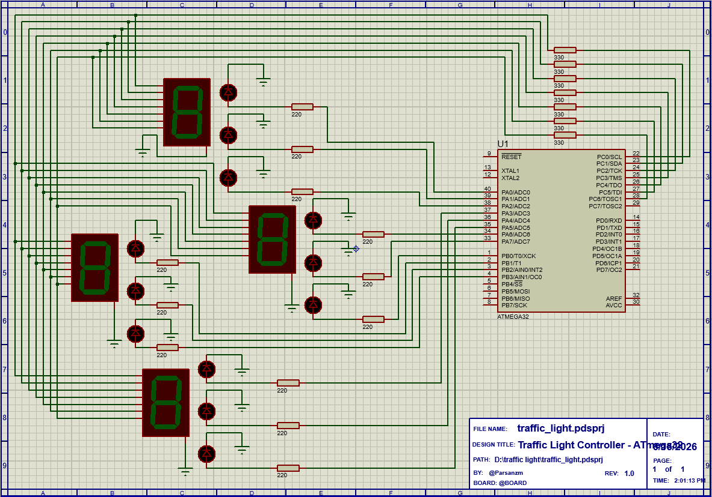

# 🚦 Traffic Light Controller using ATmega32

<p align="center">
  
</p>

<h3 align="center">
Embedded Four-Way Traffic Intersection Simulation
</h3>

<p align="center">
Designed with <b>ATmega32</b> • Simulated in <b>Proteus</b> • Programmed using <b>CodeVisionAVR</b>
</p>

---

## 📖 Overview

This project presents a **Four-Way Traffic Light Controller** implemented on the **ATmega32 microcontroller** and simulated in **Proteus ISIS**.

The controller manages traffic flow at a road intersection by controlling red, yellow, and green signals while displaying a countdown timer through seven-segment displays.

The system is implemented using a **Finite State Machine (FSM)** approach and utilizes **Timer0 interrupts** for precise timing and state transitions.

---

## 🎬 Live Simulation

<p align="center">
  
</p>

The animation above demonstrates the operation of the traffic light controller during simulation, including traffic signal transitions and countdown behavior.

---

## ✨ Features

* 🚥 Four-way traffic intersection control
* ⏳ Real-time countdown display
* ⚡ Interrupt-driven timing system
* 🔄 Finite State Machine (FSM) architecture
* 🟢 Green signal phase
* 🟡 Blinking yellow transition phase
* 🔴 Automatic traffic flow management
* 🧪 Fully tested in Proteus simulation environment

---

## 🏗️ Hardware Components

| Component              | Description              |
| ---------------------- | ------------------------ |
| ATmega32               | Main Microcontroller     |
| LEDs                   | Traffic Light Indicators |
| Seven Segment Displays | Countdown Display        |
| Resistors              | Current Limiting         |
| Crystal Oscillator     | Clock Source             |
| Capacitors             | Circuit Stability        |

---

## 🧠 System Operation

The controller continuously cycles through four operating states:

```text
NS_GREEN
   ↓
NS_YELLOW
   ↓
EW_GREEN
   ↓
EW_YELLOW
   ↓
REPEAT
```

Where:

* **NS** = North–South Direction
* **EW** = East–West Direction

This sequence guarantees safe traffic management by ensuring that only one traffic direction receives a green signal at a time.

---

## 💻 Software Environment

| Tool           | Purpose              |
| -------------- | -------------------- |
| CodeVisionAVR  | Firmware Development |
| Proteus ISIS   | Circuit Simulation   |
| AVR C Language | Embedded Programming |

---

## 📂 Project Structure

```text
Traffic-Light-Controller/
│
├── Code/
│   └── main.c
│
├── Proteus/
│   ├── traffic_light.pdsprj
│   └── traffic_light.hex
│
├── Images/
│   ├── circuit.png
│   └── demo.gif
│
├── README.md
└── LICENSE
```

---

## 🚀 Getting Started

### 1️⃣ Open the Proteus Project

Navigate to:

```text
Proteus/traffic_light.pdsprj
```

and open the project using Proteus ISIS.

### 2️⃣ Load the HEX File

The compiled firmware is already available at:

```text
Proteus/traffic_light.hex
```

Attach it to the ATmega32 microcontroller if required.

### 3️⃣ Run the Simulation

Start the simulation and observe:

* Traffic light sequencing
* Countdown display operation
* Yellow signal blinking behavior
* Automatic state transitions

---

## 🎯 Educational Concepts Demonstrated

This project covers several fundamental embedded systems concepts:

* AVR Microcontroller Programming
* Timer Interrupts
* Digital Electronics
* Traffic Signal Control Logic
* Finite State Machines (FSM)
* Real-Time Embedded Systems

---

## 🔮 Possible Future Enhancements

* 🚶 Pedestrian Crossing System
* 🚑 Emergency Vehicle Priority
* 🚗 Traffic Density Detection Sensors
* 📟 LCD Status Display
* 🌐 IoT-Based Traffic Monitoring
* 🤖 Adaptive Signal Timing Algorithm

---

## 📜 License

This project is released under the terms of the included LICENSE file.

---

## 👨‍💻 Author

**Parsa**

Computer Engineering Student

Designed as an Embedded Systems and Microcontroller Engineering Project.

---

<p align="center">
  <b>🚦 Safe Traffic Starts with Smart Control 🚦</b>
</p>
